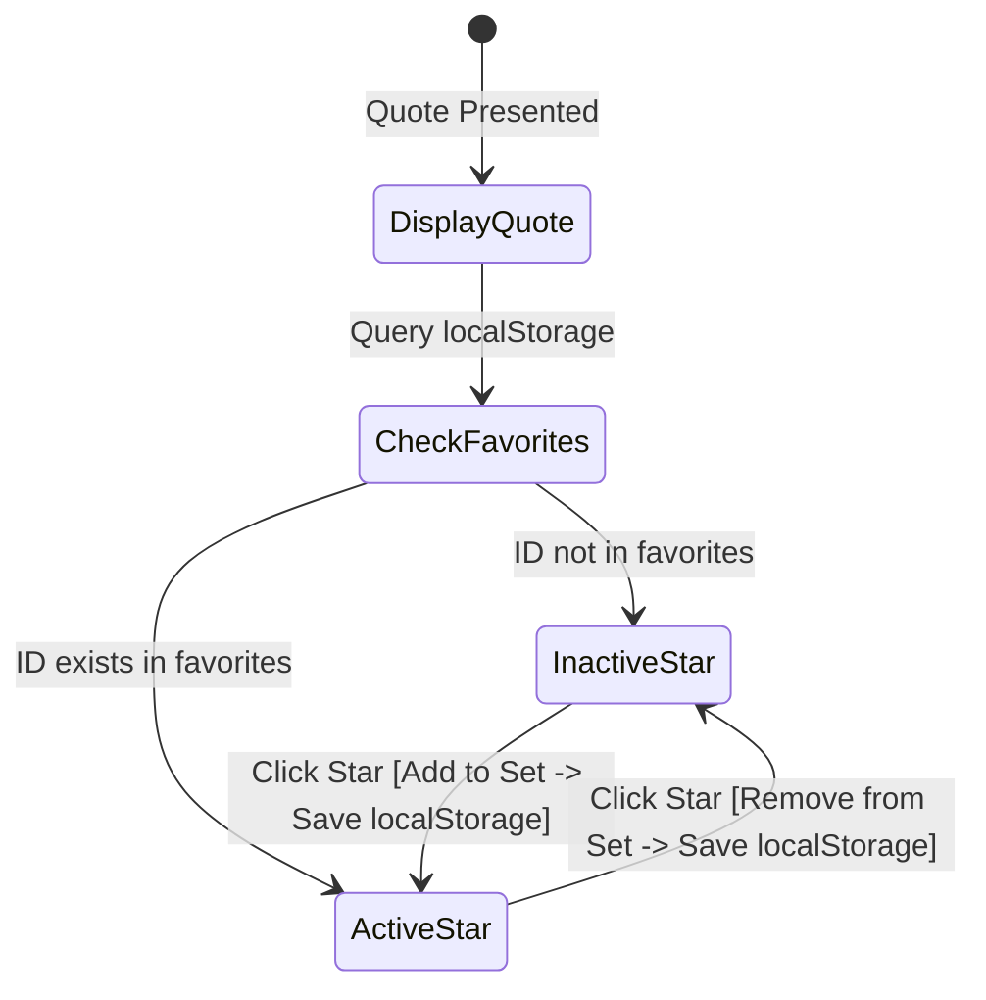

# Phase 1: Data Model & State Specifications

**Feature**: Quote of the Day Page (`specs/001-quote-of-the-day`)  
**Date**: 2026-10-06  
**Status**: Completed  
**Directives**: Plain HTML/CSS/JavaScript, no backend, localStorage persistence.

---

## 1. Entities

### `Quote`
Represents an individual quote item in the built-in collection.

| Field | Type | Required | Description | Constraints |
|:---|:---|:---:|:---|:---|
| `id` | `string` | Yes | Unique identifier for the quote | Non-empty, unique across collection (e.g., `"q-01"`) |
| `text` | `string` | Yes | The text content of the quote | Non-empty string, length $\ge 3$ characters |
| `author` | `string` | Yes | The person or entity credited with the quote | Non-empty string, length $\ge 1$ character |

#### Plain JavaScript Structure:
```javascript
{
  id: "q-01",
  text: "The only way to do great work is to love what you do.",
  author: "Steve Jobs"
}
```

---

### `FavoriteState` & Persistence
Represents client-side user favorites stored in browser `localStorage`.

| Field | Type | Storage Format | Description |
|:---|:---|:---|:---|
| `favoritedQuoteIds` | `Set<string>` (in-memory) | JSON array of strings in `localStorage` | Unique quote IDs favorited by the user |

- **Storage Key**: `"quote_of_the_day_favorites"`
- **Storage Value Example**: `["q-01", "q-05", "q-10"]`

---

### `StarControlState`
Represents the presentation and accessibility state for the active quote's favorite toggle control.

| State Property | Inactive (Unfavorited) | Active (Favorited) |
|:---|:---|:---|
| `isFavorited` | `false` | `true` |
| `aria-pressed` | `"false"` | `"true"` |
| `aria-label` | `"Add quote to favorites"` | `"Remove quote from favorites"` |
| `visibleText` | `"Favorite"` | `"Favorited"` |
| `starVisualClass` | *default button styling* | `.is-favorited` (gold highlight, filled star) |

---

## 2. State Machine & Storage Invariants



1. **Storage Read**:
   - On load, parse `localStorage.getItem("quote_of_the_day_favorites")`.
   - If missing, invalid, or corrupted, initialize with an empty `Set`.
2. **Toggle Operation**:
   - `toggleFavorite(quoteId)`:
     - If `quoteId` in `Set`: delete `quoteId`, persist array to `localStorage`, return `false`.
     - If `quoteId` not in `Set`: add `quoteId`, persist array to `localStorage`, return `true`.
3. **Storage Write**:
   - Serialize `Array.from(favoriteIds)` to JSON and store in `localStorage`.
   - Wrapped in `try...catch` to fall back to in-memory set if storage is unavailable or quota is exceeded.
