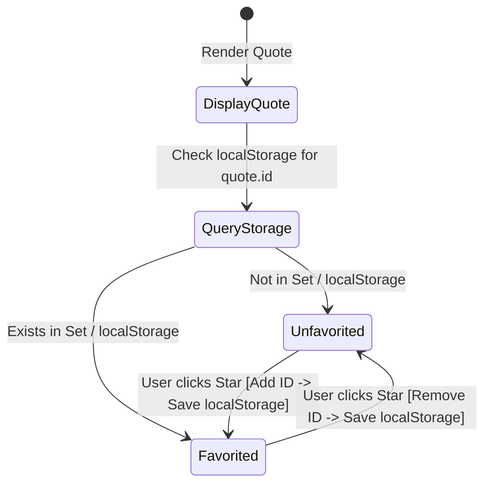

# Phase 1: Data Model & State Specifications

**Feature**: Quote of the Day Page (`specs/001-quote-of-the-day`)  
**Date**: 2026-10-07  
**Status**: Completed  
**Assignment Constraint**: Plain HTML/CSS/JavaScript, no TypeScript, no Vite, no framework, no backend.

---

## 1. Entities (Plain JavaScript)

### `Quote`
Represents an individual quote item in the built-in collection.

| Field | Type | Required | Description | Constraints |
|:---|:---|:---:|:---|:---|
| `id` | `string` | Yes | Unique identifier for the quote | Non-empty string (e.g., `"q-01"`) |
| `text` | `string` | Yes | Verbatim quote content | Non-empty string, length $\ge 3$ characters |
| `author` | `string` | Yes | Person or source credited | Non-empty string, length $\ge 1$ character |

#### Plain JavaScript Object Structure:
```javascript
/**
 * @typedef {Object} Quote
 * @property {string} id - Unique identifier (e.g., "q-01")
 * @property {string} text - Quote text content
 * @property {string} author - Author or speaker name
 */
const sampleQuote = {
  id: "q-01",
  text: "The only way to do great work is to love what you do.",
  author: "Steve Jobs"
};
```

---

### `FavoriteState` (localStorage Persistence)
Represents the set of user-favorited quote identifiers persisted in browser storage.

| Field | In-Memory Representation | localStorage Storage Format | Storage Key |
|:---|:---|:---|:---|
| `favoritedQuoteIds` | `Set<string>` | JSON array of strings | `"quote_of_the_day_favorites"` |

- **Serialized Example**: `["q-01", "q-05", "q-10"]`
- **Fallback**: Initialized to empty `Set` if `localStorage` is empty, inaccessible, or corrupted.

---

### `StarControlState` (UI Presentation & Accessibility)
Represents the presentation and accessibility attributes for the active quote's favorite star button.

| Attribute / Property | Inactive (Unfavorited) | Active (Favorited) |
|:---|:---|:---|
| `aria-pressed` | `"false"` | `"true"` |
| `aria-label` | `"Add quote to favorites"` | `"Remove quote from favorites"` |
| `.favorite-text` | `"Favorite"` | `"Favorited"` |
| Button CSS Classes | `btn btn-favorite` | `btn btn-favorite is-favorited` |
| Star Icon Visual | Outline, muted color (`#94a3b8`) | Gold highlight (`#f59e0b`), scaled transform |

---

## 2. State Machine & Storage Invariants



1. **Read on Quote Render**:
   - Check if `currentQuote.id` is in the active favorites set.
   - Set star button attributes: `aria-pressed`, `aria-label`, visible text, and `.is-favorited` class accordingly.
2. **Toggle on Click**:
   - If favorited: remove ID from set, serialize to JSON, save to `localStorage`, update UI to unfavorited.
   - If unfavorited: add ID to set, serialize to JSON, save to `localStorage`, update UI to favorited.
3. **Storage Resilience**:
   - Wrap all `localStorage` access in `try...catch`. If `localStorage` throws or is unavailable, maintain state in-memory so user interactions continue smoothly without errors.
